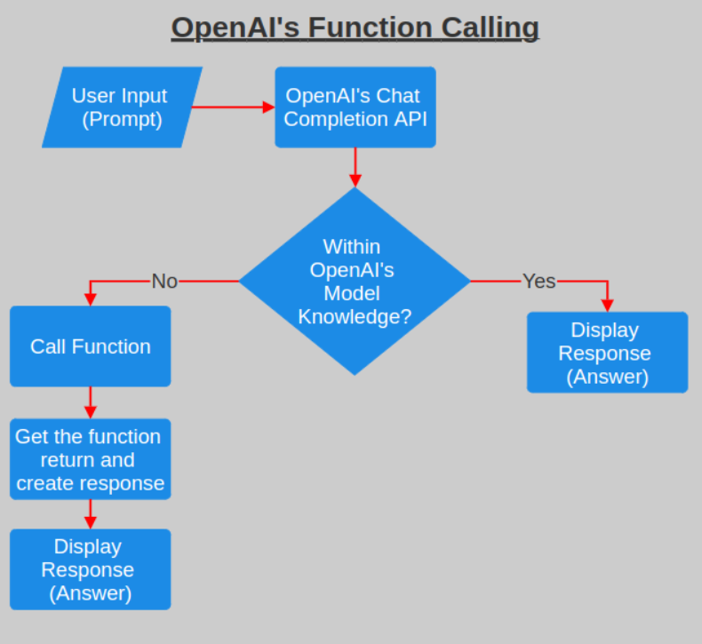
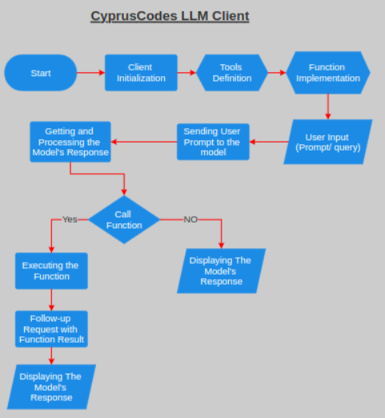
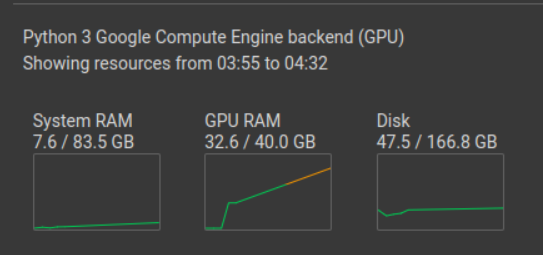
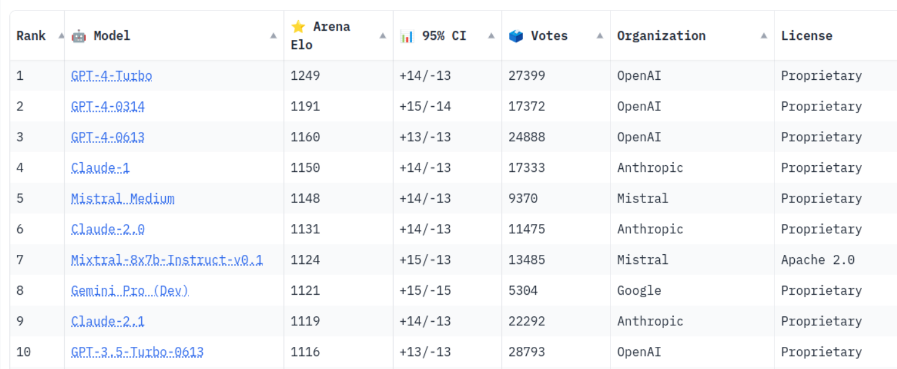

# CyprusCodes LLM

CyprusCodes LLM, is a language model that can interpret and execute functions/tools. 

The model is designed to intelligently decide the timing and sequence of function executions, opting for either parallel or serial processing based on the requirements. It is capable of interpreting the outputs of these functions and initiates them only when necessary. The definitions of these functions are structured as JSON Schema Objects, which bear resemblance to the function calls used in OpenAI GPT.

## What is OpenAI's Function Calling

In an API call, you can describe functions and have the model intelligently choose to output a JSON object containing arguments to call one or many functions. The Chat Completions API does not call the function; instead, the model generates JSON that you can use to call the function in your code.

How it works ? 




## Setup Server On Google Collb

You can set up a server on Google Colab to run your projects. There are two ways to do this: using cloud computing resources or running it locally. In this guide, we will use Google Colab for cloud-based server setup.

1. Create New Collab Note Book

2. Mount Google Drive: To access your Google Drive files, you need to mount it. Use the following command to mount your drive:
```bash
from google.colab import drive
drive.mount("/content/gdrive")
```

3. Change Directory to MyDrive: Navigate to your Google Drive's MyDrive directory using this command:
```bash
%cd /content/gdrive/MyDrive/
```
4. Create a New Directory: Create a new directory, for example, "cypruscodesllm_test" using the following code:
```python

import os

# Define the directory path
directory_path = '/content/gdrive/MyDrive/cypruscodesllm_test'

# Check if the directory already exists
if not os.path.exists(directory_path):
    # Create the directory
    os.makedirs(directory_path)
    print(f"Directory '{directory_path}' created successfully.")
else:
    print(f"Directory '{directory_path}' already exists.")
```
5. Change Directory to the Created Directory: Navigate to the newly created directory:
```bash
%cd cypruscodesllm_test
```

6. Clone this repository inside the created directory
```bash
git clone https://github.com/Jawabreh0/CyprusCodes_LLM.git
```

7. Clone the Model Repository: Clone the model repository. Note that this repository contains LFS files.
```bash
git clone https://huggingface.co/meetkai/functionary-7b-v2
```

8. Change Directory to CyprusCodes_LLM inference server and Install Requirements: Navigate to the CyprusCodes_LLM directory and install the required dependencies:
```bash
%cd CyprusCodes_LLM/inference
pip install -r requirements.txt
```

9. Start google collab terminal CyprusCodes_LLM (availbe only for paid accounts)

10. Change Directory to CyprusCodes_LLM: Inside the terminal, change the directory to CyprusCodes_LLM:
```bash
cd gdrice/MyDrive/cypruscodesllm_test/CyprusCodes_LLM/inference
```

11. Run the Server: Run the server from the terminal (do not run it from the cells):
```bash
python3 server_vllm.py --model "/content/gdrive/MyDrive/cypruscodesllm_test/functionary-7b-v2" --host 0.0.0.0
```

12. Give It Time: Allow some time for the server to start running. Please note that you need a paid Colab account with at least an Nvidia A100 GPU with 30-40 GPU vRAM.

13. Check Server Status: After running the server, ensure that it is running correctly and functioning as expected.

14. Add a New Cell to Install ngrok and Set the Tunnel Token: Install ngrok and set the tunnel token in a new cell:
```bash
!pip install pyngrok
!ngrok authtoken REPLACE_THIS_WITH_YOUR_NGROK_TOKEN
```

15. Create a Public URL: Create a public URL for your server:
```bash
from pyngrok import ngrok
public_url = ngrok.connect(addr="8000", proto="http")
print("Public URL:", public_url
```

Now, your server is running in the terminal, and you have provided a public URL for clients to access it.


## Setting Up the Client on Your Machine and Starting a Conversation
To interact with the CyprusCodes LLM server, follow these steps to set up the client on your local machine:

1. Clone the Repository Clone the project repository to your machine using the following command:
```bash
git clone https://github.com/Jawabreh0/CyprusCodes_LLM.git
```

2. Navigate to the Client Directory Change the directory to the "client" directory within the cloned repository and install the client's requirements:
```bash
cd client
pip install -r requirements.txt
```

3. Open the Client Directory You can open the client files using your preferred code editor, such as Visual Studio Code or PyCharm.

4. Configure Conversation.py
In the "conversation.py" file, make the following adjustments:
    * Update the server_url in line number 4 to match the public server URL provided by ngrok.
    * Modify the model in line number 19 to align with the argument "--model" used in the deployment scripts, either "server_vllm.py" or "server.py."

6. Run Conversation.py Execute the "conversation.py" script. Provide a prompt, and you will receive a response from the CyprusCodes LLM.

7. Engage in Function Calling (Optional) If you want to have conversations with function calling capabilities, follow these additional steps:
    * Navigate to the "function_calling.py" file.
    * Modify the openai.api_base and model as you did in "conversation.py."
    * Run the script, provide a prompt, and receive a response with function calling capabilities.

8. . Customize Function Calling (Optional)
You can customize the "function_calling.py" script according to your specific requirements, allowing you to tailor the interactions with the CyprusCodes LLM to suit your needs.
## How Client Works? 



1. Client Initialization: The OpenAI client is initialized with a specific base URL and API key. This setup allows communication with the MeetKai server.

2. Tools Definition: An array of tools is defined. Each tool (function) has a name, description, and parameters (structured as JSON schema). In this example, get_flight_info is the defined tool.

3. Function Implementation: The get_flight_info function is implemented in Python. It should contain the logic to return flight information based on the origin and destination. Here, it’s a placeholder that returns a mock response.

4. Sending User Prompt: The script sends a user prompt to the MeetKai model by constructing a request payload with the user's message and the defined tools.

5. Processing the Model's Response: After sending the initial request, the script checks if the model's response includes a call to any of the defined tools.

6. Executing the Function: If a function call is detected, the script extracts the arguments, calls the corresponding Python function (get_flight_info), and captures the result.

7. Follow-up Request with Function Result: The script then sends a follow-up request to the model, including both the original user prompt and the result of the function call. This allows the model to generate a response that incorporates the function's output.

8. Displaying the Final Output: Finally, the script prints the model's response to the follow-up request, providing a complete answer based on the function's execution.

## Hardware Resources Needed:
This type of work is hardware hungry work, so according to our test the required hardware resourses is 
* GPU With 40GB vRam such as Nvidea V100 or 2x RTX3090/TI with NvLink
* 8-16 GB Ram
* Any CPU with 8 cores and multi threading such as Intel i7 10700F

Here is the hardware resources usage during our tests 



## Other Solutions:
There are a lot of resources on the internet to run your LLM localy including but not limited to the following
- LocalAGI
- superAGI
- AutoGPT
- babyGPT
- MultiOn_AI
- AgentGPT
- God_Mood
- ibabyAGI / ios
- LocalAI
  
Many of these projects are commendable, but if you are seeking a hassle-free and dependable solution for running your local Large Language Model (LLM) with function calling, this is undoubtedly the optimal choice.

## LocalAI
LocalAI is indeed a noteworthy project for achieving your goals in the AI field. It offers a wide range of models and provides flexibility in working with them. However, there is a significant drawback to consider. LocalAI is primarily designed for running models on your CPU rather than utilizing the power of a GPU.

When it comes to running Large Language Models (LLMs) like Mistral 7B or LLaMA, opting for a GPU over a CPU is a highly recommended choice. GPUs excel in handling the intensive mathematical operations required by LLMs, thanks to their parallel processing capabilities and optimized performance. This translates into faster execution, efficient memory usage, and cost-effective high-performance computing. As a result, GPUs are the preferred option for researchers and developers dealing with LLMs, especially when dealing with large models and datasets.

To put it in perspective, we conducted a test using LocalAI on a 4-core CPU with multi-threading, and it took us 3 minutes to receive a response from the LLM. While running an LLM on your CPU can be suitable for specific reasons, if you prioritize reliability and efficiency, GPU usage is the way to go.

It's worth noting that LocalAI does support running your Local LLM on a GPU, although it's not the primary focus of their project. Below is an example demonstrating the time it takes for LocalAI to return a response from a 7B Param LLM running on a 4-core CPU with multi-threading.

https://github.com/Jawabreh0/CyprusCodes_LLM/assets/98946028/bc98448c-dd72-4f67-a6d7-3b36745d0482

## What Are The Best Open-Source LLM's We Can Use

Here's a [Link]([https://www.openai.com](https://huggingface.co/spaces/lmsys/chatbot-arena-leaderboard)) to the LLM leaders dashbord on HUggingFace, below is the top-10 LLMs, but if you take a look you will find that only mIXTRAL-8x7b-Instruct-v0.1 model in the top 10 is the open-source LLM so it's the best choice.




